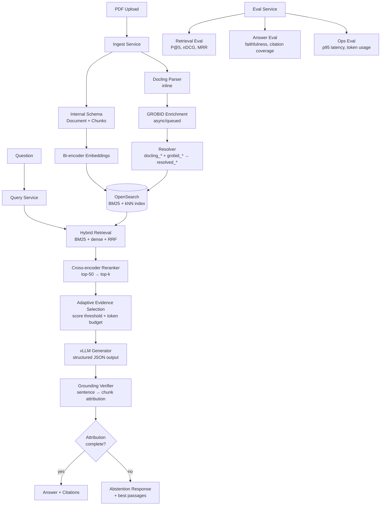

# grounded-rag-sciqa

**Production-grade grounded RAG for scientific paper Q&A — every answer sentence is traceable to a source chunk, or the system abstains.**

Built to solve the core failure mode of naive RAG on scientific literature: confident answers that cite the wrong evidence, hallucinate numbers, or silently omit conflicting results. This system enforces a hard grounding contract at the service boundary, not the prompt level.

---

## Architecture



---

## What's novel

**1. Hard grounding contract enforced at the service boundary.**
Every factual sentence in the answer must have at least one `supporting_chunk_id`. This is validated server-side against retrieved chunk IDs — the generator cannot produce an unattributed claim. Abstention is triggered by the system (reranker score below threshold, evidence disagreement, attribution failure) rather than by instructing the model not to hallucinate.

**2. Source-specific field separation with versioned resolution.**
Docling and GROBID outputs are stored in separate fields (`docling_title`, `grobid_title`) and never overwrite each other. A deterministic `ResolutionPolicy` (versioned) merges them into `resolved_*` fields. This eliminates a class of silent staleness bugs common in multi-parser pipelines, and lets you re-resolve without re-parsing when heuristics improve.

**3. Async enrichment with explicit projection state.**
GROBID enrichment runs async so it never blocks ingestion throughput. A `SearchProjection` record tracks index state separately from DB state — `enriched_projection_applied` is the authoritative flag for whether author/citation filters are live. The query service gates enrichment-dependent filters on this flag, never on nullable fields.

---

## Stack

| Layer | Technology |
|-------|------------|
| Primary parse | [Docling](https://github.com/DS4SD/docling) — layout-aware, provenance-preserving |
| Enrichment | [GROBID](https://grobid.readthedocs.io) — async, web-service mode |
| Search | OpenSearch 2.x — BM25 + kNN + hybrid pipeline |
| Generation | [vLLM](https://docs.vllm.ai) — structured JSON output with constrained decoding |
| Evaluation | [Ragas](https://docs.ragas.io) + custom harness |
| Schema / contracts | Pydantic v2, Python 3.11 |

---

## Services

| Service | Port | Responsibility |
|---------|------|----------------|
| ingest  | 8001 | upload · parse · chunk · embed · index |
| query   | 8002 | retrieve · rerank · generate · cite · abstain |
| eval    | 8003 | retrieval / QA / summarization benchmarks |

---

## Quick start

```bash
# 1. Start infrastructure
cp .env.example .env
docker compose -f infra/compose/docker-compose.yml up -d

# 2. Install libs
pip install -e libs/schema -e libs/events -e libs/common

# 3. Start services
uvicorn services.ingest.app.main:app --port 8001 --reload &
uvicorn services.query.app.main:app  --port 8002 --reload &

# 4. Ingest a paper
curl -X POST http://localhost:8001/documents \
     -F "file=@paper.pdf"

# 5. Ask a question
curl -X POST http://localhost:8002/qa \
     -H "Content-Type: application/json" \
     -d '{"question": "What was the best F1 score reported?"}'
```

---

## Ingestion pipeline

```
Upload → SHA-256 dedup → Docling parse (inline)
       → section-aware chunking → bi-encoder embed → OpenSearch index
       → [async] GROBID enrich → resolve fields → metadata reindex
       → SearchProjection activated → enriched filters live
```

Idempotent: re-uploading the same file returns the existing `doc_id`.
Incremental: only changed chunks are re-embedded on reingest.
Versioned: parser, chunker, and embedding model versions stored on every artifact.

---

## Grounding contract

The generator returns structured JSON:

```json
{
  "answer": "The model achieved an F1 score of 0.847 on the SciERC dataset.",
  "sentences": [
    {
      "text": "The model achieved an F1 score of 0.847 on the SciERC dataset.",
      "supporting_chunk_ids": ["c42", "c77"],
      "confidence": 0.91
    }
  ],
  "abstained": false
}
```

If `supporting_chunk_ids` cannot be assigned for a sentence, the system either rewrites it as uncertainty or sets `abstained: true`. No factual claim passes through without evidence.

**Abstention triggers:** top reranker score below threshold · evidence set too small · evidence clusters disagree · attribution cannot be completed · required facts not in retrieved context.

---

## Evaluation

Three-layer evaluation tracked separately:

| Layer | Metrics |
|-------|---------|
| Retrieval | Precision@5, Recall@5, nDCG@5, MRR, context precision/recall |
| Answer | faithfulness, unsupported-claim rate, citation coverage, abstention precision |
| Ops | p50/p95/p99 latency, parse failure rate, avg token usage, cache hit rate |

Regression gate: release only when all three layers pass configured thresholds.

---

## Repo layout

```
grounded-rag-sciqa/
  libs/
    schema/       canonical Document, Chunk, SearchProjection models + state machine
    events/       pipeline event types (discriminated union)
    common/       shared utilities
  services/
    ingest/       FastAPI — upload, parse, embed, index
    query/        FastAPI — retrieve, rerank, generate, cite, abstain
    eval/         FastAPI — retrieval / QA / summarization benchmarks
  infra/
    compose/      Docker Compose (OpenSearch + Postgres + services)
  datasets/
    eval_retrieval/
    eval_qa/
    eval_summarization/
  tests/
    schema/       state machine + model tests (41 passing)
```

---

## Implementation status

| Component | Status |
|-----------|--------|
| Schema + state machine | ✅ 41 tests passing |
| Pipeline event types | ✅ complete |
| Service API contracts | ✅ typed stubs |
| Docling parse worker | 🔧 in progress |
| GROBID enrichment worker | 🔧 in progress |
| OpenSearch indexing | 🔧 in progress |
| Hybrid retrieval + RRF | 📋 planned |
| Cross-encoder reranking | 📋 planned |
| Structured answer generation | 📋 planned |
| Grounding verifier | 📋 planned |
| Eval harness | 📋 planned |

---

## License

Apache 2.0 — see [LICENSE](LICENSE).
