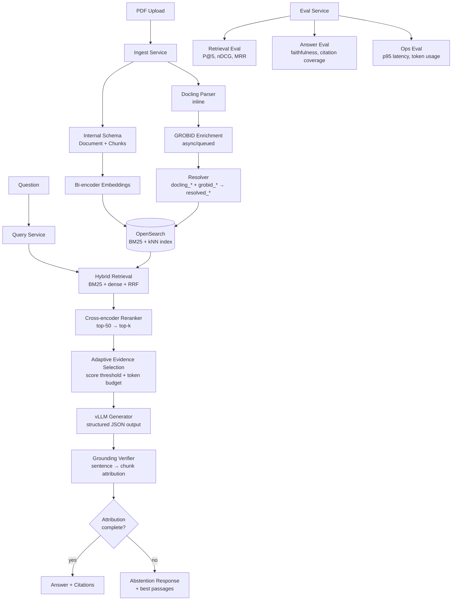

# grounded-rag-sciqa

**Production-grade scaffold for grounded scientific RAG — schema-first, citation-enforced, and implemented in phases.**

Built to solve the core failure mode of naive RAG on scientific literature: confident answers that cite the wrong evidence, hallucinate numbers, or silently omit conflicting results. The project is shaped around a hard grounding contract at the service boundary, not prompt-only instructions.

## Current status

Complete:
- Canonical schema for documents, chunks, projections, and ingestion state.
- Pipeline event contracts for parse, enrichment, indexing, and projection activation.
- Service API contracts for ingest, query, and eval.
- Grounding contract models plus a deterministic sentence-level verifier.
- Local text chunking, in-memory retrieval, extractive cited answer baseline, and abstention path.
- `/qa` local demo path for inline passages.
- Toy local baseline eval with committed dataset and result artifact.
- Demo notebook for answerable, abstention, and numeric-claim rejection cases.
- 46 tests covering schema state transitions, model defaults, local retrieval, and grounding enforcement.

Working next:
- Persistent indexing behind `/qa` instead of inline demo passages.
- Minimal file ingestion for local text/PDF documents.

Planned:
- Docling/GROBID enrichment, OpenSearch hybrid retrieval, cross-encoder reranking, generation, and regression-gated evaluation.

---

## Target architecture



---

## What's novel

**1. Hard grounding contract enforced at the service boundary.**
Every factual sentence in the answer must have at least one `supporting_chunk_id`. This is validated server-side against retrieved chunk IDs; the generator cannot publish an unattributed claim. The current verifier rejects missing citations, citations to chunks that were not retrieved, insufficient evidence overlap, and numeric claims whose values do not appear in cited evidence. Abstention is triggered by system checks rather than by asking the model not to hallucinate.

**2. Source-specific field separation with versioned resolution.**
Docling and GROBID outputs are stored in separate fields (`docling_title`, `grobid_title`) and never overwrite each other. A deterministic `ResolutionPolicy` (versioned) merges them into `resolved_*` fields. This eliminates a class of silent staleness bugs common in multi-parser pipelines, and lets you re-resolve without re-parsing when heuristics improve.

**3. Async enrichment with explicit projection state.**
GROBID enrichment runs async so it never blocks ingestion throughput. A `SearchProjection` record tracks index state separately from DB state — `enriched_projection_applied` is the authoritative flag for whether author/citation filters are live. The query service gates enrichment-dependent filters on this flag, never on nullable fields.

---

## Stack

Current local implementation:

| Layer | Technology |
|-------|------------|
| Contracts | Pydantic v2 shared models |
| Local retrieval | In-memory TF-IDF style retriever |
| Local answer baseline | Extractive cited-sentence selection from retrieved chunks |
| Grounding verification | Deterministic sentence-to-chunk verifier |
| Test harness | pytest |

Target production implementation:

| Layer | Technology |
|-------|------------|
| Primary parse | [Docling](https://github.com/DS4SD/docling) — layout-aware, provenance-preserving |
| Enrichment | [GROBID](https://grobid.readthedocs.io) — async, web-service mode |
| Search | OpenSearch 2.x — BM25 + kNN + hybrid pipeline |
| Generation | [vLLM](https://docs.vllm.ai) — structured JSON output with constrained decoding |
| Evaluation | [Ragas](https://docs.ragas.io) + custom harness |
| Schema / contracts | Pydantic v2, Python 3.11 |

---

## Target services

| Service | Port | Responsibility |
|---------|------|----------------|
| ingest  | 8001 | upload · parse · chunk · embed · index |
| query   | 8002 | retrieve · rerank · generate · cite · abstain |
| eval    | 8003 | retrieval / QA / summarization benchmarks |

---

## Developer quick start

```bash
# 1. Install shared packages
make install-dev

# 2. Verify current contracts
make test

# 3. Start the local query demo
uvicorn services.query.app.main:app --port 8002
```

In another terminal:

```bash
curl -X POST http://localhost:8002/qa \
  -H "Content-Type: application/json" \
  -d '{
    "question": "How much did the model improve F1?",
    "passages": [
      "The retrieval-augmented model improved F1 by 4.2 points on SciFact."
    ]
  }'
```

The HTTP path currently accepts inline passages for local demos. Persistent
document ingestion and indexed retrieval are the next implementation milestone.

---

## Target ingestion pipeline

```
Upload → SHA-256 dedup → Docling parse (inline)
       → section-aware chunking → bi-encoder embed → OpenSearch index
       → [async] GROBID enrich → resolve fields → metadata reindex
       → SearchProjection activated → enriched filters live
```

Idempotent: re-uploading the same file returns the existing `doc_id`.
Incremental: only changed chunks are re-embedded on reingest.
Versioned: parser, chunker, and embedding model versions stored on every artifact.

---

## Grounding contract

The generator must return structured sentence-level output:

```json
{
  "answer": "The model achieved an F1 score of 0.847 on the SciERC dataset.",
  "sentences": [
    {
      "text": "The model achieved an F1 score of 0.847 on the SciERC dataset.",
      "supporting_chunk_ids": ["c42", "c77"],
      "confidence": 0.91
    }
  ],
  "abstained": false
}
```

The query service verifier checks each sentence against the retrieved evidence set. If `supporting_chunk_ids` cannot be assigned, point to chunks that were not retrieved, fail lexical support checks, or cite numbers absent from the evidence, the whole answer is marked `abstained: true`. No factual claim should pass the service boundary without evidence.

Current implemented triggers:
- Missing `supporting_chunk_ids`.
- Supporting chunk ID was not retrieved for the request.
- Sentence/evidence overlap is below policy threshold.
- Numeric claim is not present in cited evidence.
- No answer sentences were produced.

Planned production triggers:
- Top reranker score below threshold.
- Evidence set too small.
- Evidence clusters disagree.
- Required facts not found in retrieved context.

Implementation references:
- `libs/schema/sciqa_schema/grounding.py`
- `services/query/app/core/grounding.py`
- `services/query/app/core/local_rag.py`
- `tests/query/test_grounding_verifier.py`
- `tests/query/test_local_rag.py`

---

## Evaluation

Three-layer evaluation tracked separately:

| Layer | Metrics |
|-------|---------|
| Retrieval | Precision@5, Recall@5, nDCG@5, MRR, context precision/recall |
| Answer | faithfulness, unsupported-claim rate, citation coverage, abstention precision |
| Ops | p50/p95/p99 latency, parse failure rate, avg token usage, cache hit rate |

Regression gate: release only when all three layers pass configured thresholds.

Current local baseline result:

| Metric | Value |
|--------|-------|
| Dataset | `datasets/eval_qa/local_baseline_v0.jsonl` |
| Questions | 10 |
| Exact answer match | 1.00 |
| Citation coverage | 1.00 |
| Unsupported claim rate | 0.00 |
| Abstention rate | 0.40 |
| Abstention precision / recall | 1.00 / 1.00 |
| Median local latency | 0.034 ms |

Result artifact: `results/local_baseline_v0.json`.

---

## Repo layout

```
grounded-rag-sciqa/
  libs/
    schema/       canonical Document, Chunk, SearchProjection models + state machine
    events/       pipeline event types (discriminated union)
    common/       shared utilities
  services/
    ingest/       FastAPI — upload, parse, embed, index
    query/        FastAPI — retrieve, rerank, generate, cite, abstain
    eval/         FastAPI — retrieval / QA / summarization benchmarks
  infra/
    compose/      Docker Compose (OpenSearch + Postgres + services)
  datasets/
    eval_retrieval/
    eval_qa/
    eval_summarization/
  docs/
    design_grounding_contract.md
    evaluation_methodology.md
  notebooks/
    demo_grounded_qa.ipynb
  results/
    local_baseline_v0.json
  tests/
    schema/       state machine + model tests
    query/        grounding verifier tests
```

---

## Implementation status

| Component | Status |
|-----------|--------|
| Schema + state machine | Complete |
| Pipeline event types | Complete |
| Service API contracts | Typed stubs |
| Grounding contract models | Complete |
| Deterministic grounding verifier | Complete, tested |
| Local text chunking + retrieval baseline | Complete, tested |
| Extractive cited answer baseline | Complete, tested |
| `/qa` inline-passage local demo | Complete |
| Toy local baseline eval artifact | Complete |
| Demo notebook | Complete |
| Test suite | 46 tests |
| Docling parse worker | 🔧 in progress |
| GROBID enrichment worker | 🔧 in progress |
| OpenSearch indexing | 🔧 in progress |
| Hybrid retrieval + RRF | 📋 planned |
| Cross-encoder reranking | 📋 planned |
| Structured answer generation | 📋 planned |
| LLM/NLI verifier upgrade | 📋 planned |
| Eval harness | 📋 planned |

---

## License

Apache 2.0 — see [LICENSE](LICENSE).
