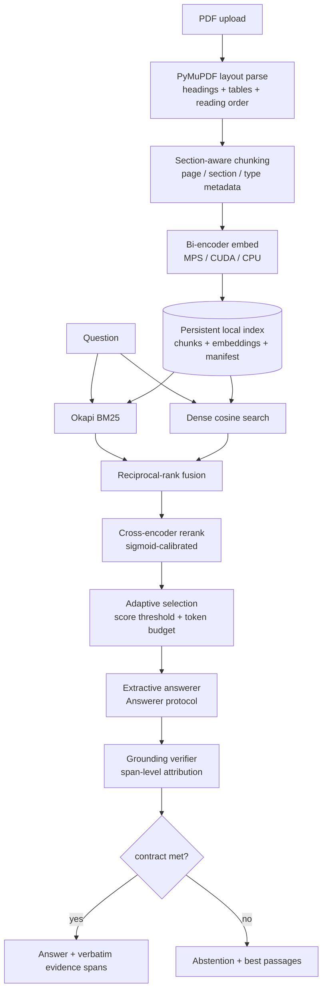

# grounded-rag-sciqa

[](https://github.com/bhaskara10/grounded-rag-sciqa/actions/workflows/ci.yml)

**Grounded RAG for scientific-paper Q&A: every published sentence carries
verbatim, character-offset evidence spans — or the system abstains.**

Built around one hard rule: no factual sentence crosses the service boundary
without machine-checked evidence. Retrieval is hybrid (BM25 + dense) with
cross-encoder reranking and adaptive evidence selection; a deterministic
verifier localizes the exact supporting characters for every answer sentence;
a three-layer eval harness (retrieval / answer / ops) runs against a QASPER
subset and its artifact is committed. Runs end-to-end on a laptop — Apple
silicon (MPS), CUDA, or CPU.

## What is implemented

- **Layout-aware PDF ingestion** (PyMuPDF): text blocks in reading order,
  font-size heading detection, ruled tables extracted as markdown;
  section-aware chunking with page / section / type metadata; SHA-256
  idempotent, appends to a persistent local index.
- **Hybrid retrieval**: in-repo Okapi BM25 + bi-encoder dense search
  (`all-MiniLM-L6-v2`), merged with reciprocal-rank fusion.
- **Cross-encoder reranking** (`ms-marco-MiniLM-L-6-v2`), sigmoid-calibrated,
  batched, device auto-selected (MPS / CUDA / CPU).
- **Adaptive evidence selection**: keep reranked chunks above a relevance
  threshold within a token budget — when nothing clears the bar, the pipeline
  abstains by construction.
- **Span-level attribution**: the grounding verifier checks citations, rejects
  numeric claims absent from evidence, and returns exact character offsets
  (`chunk.text[start:end] == span.text`) for every supported sentence.
- **Three-layer eval harness**: P@5 / R@5 / MRR / nDCG@5 (before *and* after
  reranking), ROUGE-1/2/L / BLEU / METEOR / token F1, groundedness and
  unsupported-claim rate, abstention precision/recall, p50/p95/p99 and
  per-stage latency, token usage.
- Three FastAPI services (ingest / query / eval), 130+ tests, CI.

The answerer is extractive by design — quoted sentences are always
attributable — with an `Answerer` protocol seam where an LLM generator plugs
in (see roadmap).

## Results — QASPER subset, 50 questions

Committed artifact: [`results/qasper_subset_v1.json`](results/qasper_subset_v1.json)
(regenerate with one command, below). Encoder `all-MiniLM-L6-v2`, reranker
`ms-marco-MiniLM-L-6-v2`, measured on an Apple M4 (MPS).

**Retrieval** (40 answerable questions, gold evidence paragraphs):

| Ranking | P@5 | R@5 | MRR | nDCG@5 |
|---|---|---|---|---|
| Hybrid RRF (BM25 + dense) | 0.165 | 0.534 | 0.533 | 0.455 |
| + cross-encoder rerank | **0.200** | **0.647** | **0.650** | **0.558** |

The reranker lifts every metric — reported side by side precisely so that
claim is measurable.

**Answer** (extractive answerer vs. largely abstractive gold answers — lower
bounds, reported honestly):

| ROUGE-1 | ROUGE-2 | ROUGE-L | BLEU | METEOR | Token F1 |
|---|---|---|---|---|---|
| 0.232 | 0.126 | 0.198 | 0.088 | 0.280 | 0.214 |

**Grounding & abstention**: unsupported-claim rate of published answers is
**0 by construction** (unsupported answers never publish); the system
answered 67.5% of answerable questions and abstained on the rest
(abstention recall on unanswerable questions: 0.60).

**Ops**: p50 126 ms, p95 478 ms end-to-end; reranking dominates
(~199 ms mean); ~175 evidence tokens selected per answer.

## Quick start

```bash
python -m venv .venv && source .venv/bin/activate
make install-dev
make test          # 130+ hermetic tests, no model downloads
```

Ingest a paper and ask a question (first run downloads two ~90 MB models):

```bash
python scripts/ingest_pdf.py your_paper.pdf
python scripts/ask.py "How much did the method improve F1?"
```

```
ANSWER: The proposed method improved F1 by 4.2 points on SciFact.

  supported by your-paper-3f2a91bc:chunk:12 [58:116]
    "The proposed method improved F1 by 4.2 points on SciFact."

latency: 210 ms
```

Or run the services:

```bash
uvicorn services.ingest.app.main:app --port 8001   # POST /documents (PDF upload)
uvicorn services.query.app.main:app  --port 8002   # POST /qa /retrieve /explain
uvicorn services.eval.app.main:app   --port 8003   # POST /runs
```

```bash
curl -X POST http://localhost:8002/qa \
  -H "Content-Type: application/json" \
  -d '{"question": "How much did the model improve F1?",
       "passages": ["The retrieval-augmented model improved F1 by 4.2 points on SciFact."]}'
```

Reproduce the eval:

```bash
python scripts/run_eval.py \
  --dataset datasets/eval_qa/qasper_subset_v1.jsonl \
  --corpus  datasets/eval_qa/qasper_subset_v1_corpus.jsonl \
  --output  results/qasper_subset_v1.json
```

## Pipeline


```mermaid
flowchart TD
    PDF[PDF upload] --> PARSE[PyMuPDF layout parse\nheadings + tables + reading order]
    PARSE --> CHUNK[Section-aware chunking\npage / section / type metadata]
    CHUNK --> EMBED[Bi-encoder embed\nMPS / CUDA / CPU]
    EMBED --> IDX[(Persistent local index\nchunks + embeddings + manifest)]

    Q[Question] --> BM25[Okapi BM25]
    Q --> DENSE[Dense cosine search]
    IDX --> BM25
    IDX --> DENSE
    BM25 --> RRF[Reciprocal-rank fusion]
    DENSE --> RRF
    RRF --> RERANK[Cross-encoder rerank\nsigmoid-calibrated]
    RERANK --> SELECT[Adaptive selection\nscore threshold + token budget]
    SELECT --> ANSWER[Extractive answerer\nAnswerer protocol]
    ANSWER --> VERIFY[Grounding verifier\nspan-level attribution]
    VERIFY --> OK{contract met?}
    OK -- yes --> OUT[Answer + verbatim evidence spans]
    OK -- no --> ABST[Abstention + best passages]
```

## The grounding contract

The verifier accepts a sentence only if it cites retrieved chunks, every
numeric claim appears in the cited evidence, and localized evidence spans
jointly cover enough of the sentence's content. Accepted sentences return
their evidence verbatim:

```json
{
  "text": "The proposed method improved F1 by 4.2 points on SciFact.",
  "supporting_chunk_ids": ["paper:chunk:12"],
  "verdict": "supported",
  "support_score": 1.0,
  "supporting_spans": [
    {
      "chunk_id": "paper:chunk:12",
      "start_char": 58,
      "end_char": 116,
      "text": "The proposed method improved F1 by 4.2 points on SciFact.",
      "score": 0.86
    }
  ]
}
```

If any sentence fails, the whole answer abstains and the response carries the
best-scoring passages instead. Full rationale:
[`docs/design_grounding_contract.md`](docs/design_grounding_contract.md).

## Evaluation

Methodology (dataset construction, per-layer definitions, calibration
tradeoffs): [`docs/evaluation_methodology.md`](docs/evaluation_methodology.md).
The harness runs the same pipeline the service serves; artifacts record
encoder, reranker, thresholds, and corpus size. The deterministic components
(`SCIQA_ENCODER=hashing SCIQA_RERANKER=lexical`) double as a weak baseline —
the committed real-model run beats it on every retrieval and answer metric.

## Repo layout

```
libs/
  schema/       Pydantic contracts: documents, chunks, grounding, spans, state machines
  events/       pipeline event types
  common/       shared utilities
services/
  ingest/       FastAPI — PDF upload, layout parse, chunk, embed, index
  query/        FastAPI — /qa /retrieve /explain; retrieval/rerank/grounding cores
  eval/         FastAPI + harness — three-layer metrics, artifacts
datasets/
  eval_qa/      QASPER subset (CC-BY-4.0, attributed) + rebuild script
results/        committed eval artifacts
scripts/        ingest_pdf.py · ask.py · run_eval.py · build_eval_dataset.py
notebooks/      demo_grounded_qa.ipynb — pipeline walkthrough
tests/          130+ tests (schema, retrieval, grounding, ingest, eval, routes)
docs/           design docs
```

Configuration is environment-driven: `SCIQA_INDEX_DIR`, `SCIQA_ENCODER`,
`SCIQA_RERANKER`, `SCIQA_MIN_RERANK_SCORE`. Tests and CI use deterministic
components (signed-hashing encoder, lexical reranker) — hermetic, no
downloads.

## Roadmap

- LLM generation behind the existing `Answerer` protocol (vLLM structured
  output), verified by the same grounding contract.
- OpenSearch backend behind the index interfaces for corpora that outgrow
  one machine (`infra/compose` has the scaffolding).
- Docling/GROBID enrichment for richer section + reference metadata.
- NLI entailment check layered onto the deterministic verifier.

## License

Apache 2.0 — see [LICENSE](LICENSE). QASPER data: CC-BY-4.0 (AllenAI),
attribution in [`datasets/eval_qa/README.md`](datasets/eval_qa/README.md).
